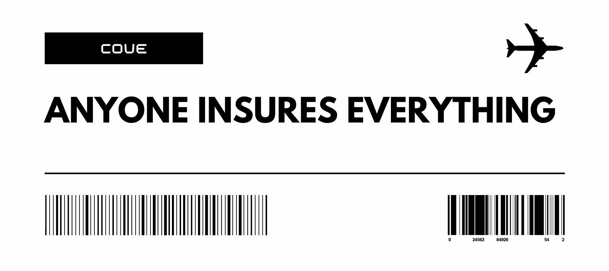

# Cove

## Problem
Flight insurance claims take months to settle, and data leaks are rampant.

## Insight
Passengers need a faster, more secure way with dynamic pricing to handle flight insurance.

## Solution
Mimicking the options modeling, Cove supplies dynamic premium pricing from providers/insurers based on real-time flight data and their risk assessment. This ensures passengers get the best rate while providers can manage risk effectively. With smart contracts, claims are processed automatically, reducing settlement time from months to minutes, and ensuring data privacy and security.